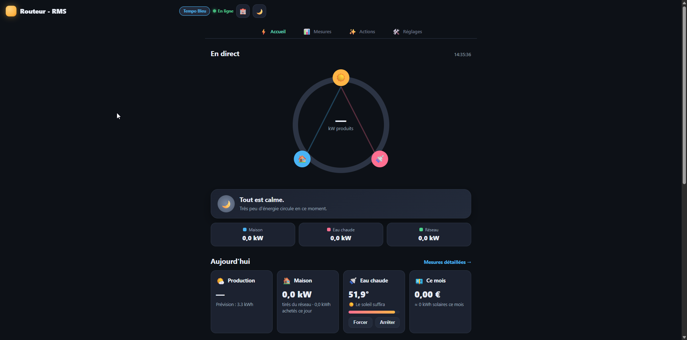
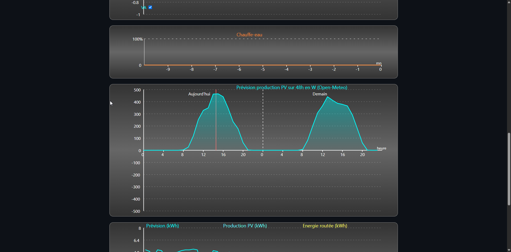
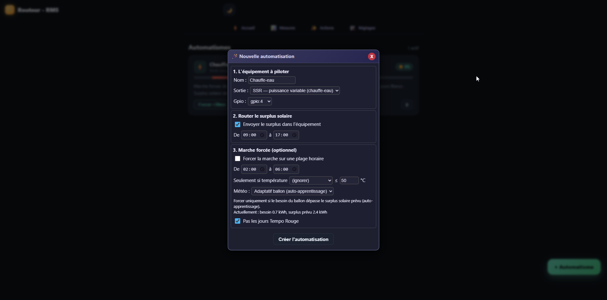
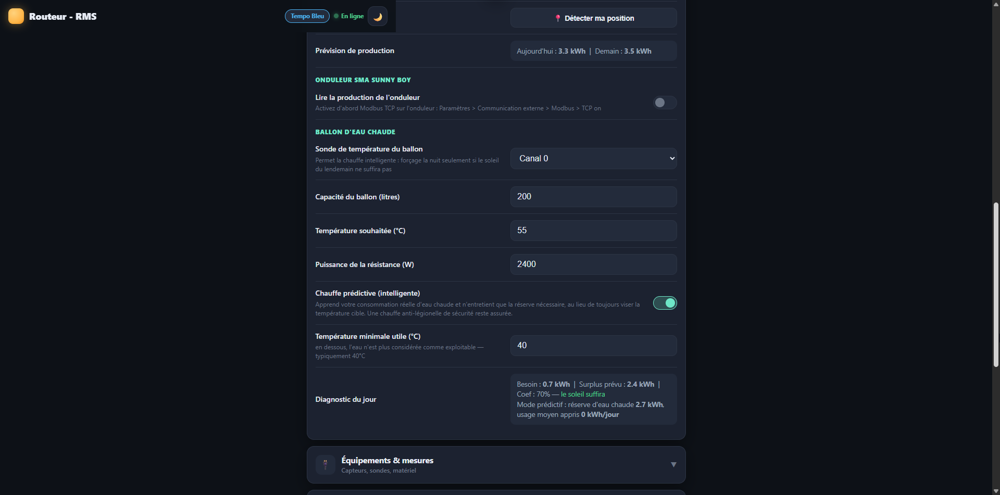

# Soleo — routeur solaire

Firmware ESP32 pour routeur photovoltaïque : automatismes autour du chauffe-eau,
prévision météo, tarification Tempo et protection du disjoncteur, avec une interface web
pensée pour le mobile.

> **Soleo est un fork du routeur RMS de [F1ATB](https://f1atb.fr)**, basé sur sa V17.16.
> Le cœur de régulation, les pilotes de mesure et l'essentiel du firmware sont son œuvre ;
> ce dépôt n'ajoute que des fonctions périphériques et une nouvelle interface.
> Documentation d'origine : **https://f1atb.fr**, section Domotique.

> ⚠️ **Fork personnel, sans garantie.** Testé sur une seule installation, avec un périmètre
> matériel réduit (voir plus bas). Ce n'est pas un remplacement du firmware officiel.
> Exportez votre configuration (page **Import / Export**) avant de flasher, et gardez de
> quoi revenir en arrière.
>
> 📌 **Base : V17.16.** Le firmware officiel poursuit son développement de son côté
> ([V17.26 au 09/2026](https://github.com/F1ATB/Solar-Router-F1ATB)) : les correctifs et
> nouveautés publiés depuis ne sont pas repris ici.

## Versions

Ce fork a **sa propre numérotation, repartie à 1.00**, pour éviter toute confusion avec
celle du firmware officiel — qui est déjà en 17.26 et continue d'avancer. Le fichier
principal garde son nom d'origine (`Solar_Router_V17_16.ino`), qui indique la base amont,
pas la version du fork.

| Incrément | Signification |
|---|---|
| `1.01`, `1.02` | Correctif |
| `1.10`, `1.20` | Nouvelle fonctionnalité |
| `2.00` | Changement majeur ou rupture du format de configuration |

Les binaires compilés sont publiés dans les
[Releases](https://github.com/jeremyper/Routeur_f1atb/releases) et accessibles directement
depuis la page **Mise à jour** du routeur.

## Licence

**GNU AGPL-3.0-or-later**, comme le firmware d'origine — voir [LICENSE](LICENSE).
Toute redistribution, modifiée ou non, doit rester sous la même licence et fournir le code source.

---

> 📖 **Vous voulez l'essayer ?** Suivez le [**guide d'installation pas à pas**](INSTALLATION.md).
> Commencez par l'étape 0 : elle vérifie en une minute si votre installation est compatible.
>
> 📡 **Suivre son routeur depuis l'extérieur**, sans ouvrir de port ni installer Home Assistant :
> voir [**Supervision à distance**](SUPERVISION_DISTANTE.md).
>
> 📱 **Application de suivi** — installable sur téléphone, se connecte à *votre* broker :
> [jeremyper.github.io/Routeur_f1atb](https://jeremyper.github.io/Routeur_f1atb/)

## Aperçu

| Tableau de bord | Mesures |
|---|---|
|  |  |
| Flux d'énergie en direct, tarif Tempo du jour, économies du mois | Prévision de production PV sur 48 h (Open-Meteo) |

| Automatismes | Réglages |
|---|---|
|  |  |
| Assistant de création en langage naturel | Ballon d'eau chaude et chauffe prédictive |

---

## Ce que ce fork ajoute

### Eau chaude sanitaire
- **Ballon intelligent** — estime la consommation réelle d'eau chaude en détectant les
  puisages (chutes de température), et n'entretient que la réserve réellement nécessaire
  au lieu de toujours viser la température cible
- **Sécurité anti-légionelle** — chauffe complète forcée après N jours sans montée en
  température, y compris en mode absence
- **Forçage adaptatif** — croise le besoin du ballon avec le surplus solaire attendu

### Prévision météo solaire
- Source **Open-Meteo** (gratuite, sans clé API) : latitude, longitude, puissance crête
- Production estimée aujourd'hui / demain, rafraîchie périodiquement
- **Nouvelle condition de période** : « actif si prévision demain/aujourd'hui < ou ≥ seuil »
  — par exemple *ne forcer le chauffe-eau la nuit que si demain s'annonce couvert*
- Auto-apprentissage du coefficient de surplus routable, historique prévision/production

### Tarification et suivi
- **Tarifs Tempo RTE** : 6 prix configurables selon la couleur du jour et HP/HC
- Suivi des **économies en €** (jour / mois / total)
- **Journal d'événements** en langage naturel

### Protection et confort
- **Délestage d'abonnement** — bride progressivement les sorties quand la puissance
  soutirée approche le calibre du disjoncteur, marches forcées comprises
- **Mode absence** — suspend les automatismes, manuellement ou sur plage de dates
- **Ventilateur SSR thermorégulé** — rampe de vitesse pilotée par une sonde sur le dissipateur

### Onduleur
- **SMA Sunny Boy** en Modbus TCP : production instantanée et énergie du jour

### Interface web
- Refonte complète : tableau de bord avec flux d'énergie, page Actions en langage naturel,
  Réglages en accordéons thématiques
- Thème clair / sombre, pensée mobile
- Feuille de style et bascule de thème mutualisées (`/commun.css`, `/theme.js`)

### Robustesse
- Appels réseau bloquants (RTE, météo, SMA) déportés sur le cœur 0 pour ne pas perturber
  la régulation, avec verrous sur les données partagées entre cœurs
- Contrôle d'accès étendu aux points d'entrée qui modifient l'état ou exposent des secrets
  (voir *Sécurité d'accès* dans [FONCTIONNALITES.md](FONCTIONNALITES.md))
- Fermeture de sécurité des sorties sur mesure de puissance périmée

---

## Périmètre matériel : plus étroit que l'original

Ce fork est **recentré sur une seule configuration matérielle**, la mienne. Plusieurs
sources et périphériques gérés par le firmware d'origine ont été retirés. Si votre
installation utilise l'un d'eux, **restez sur le firmware officiel F1ATB**.

### Sources de mesure conservées
| Source | État |
|---|---|
| **UxI** (transformateur + pince ampèremétrique) | ✅ |
| **UxIx2** (module JSY-MK-194T) | ✅ |
| **UxIx3** (module JSY-MK-333, triphasé) | ✅ |

### Sources retirées
Linky TIC, Enphase Envoy-S, Shelly EM et Pro EM, SmartGateways, HomeWizard,
puissance reçue par MQTT, ESP externe.
*(des libellés résiduels peuvent subsister dans l'interface : ils ne correspondent
à aucun pilote de lecture)*

### Autres retraits
- Écrans LCD tactiles (Sunton / CYD) et pilotes associés — seules les LED d'état restent
- Carte Ethernet WT32-ETH01

## Ce qui est conservé de l'original

- Régulation **PID** éprouvée (intégrateur dominant, P/D optionnels)
- Modes de sortie **Multi-sinus**, **Train de sinus**, **On/Off**, découpe triac
- Jusqu'à **10 actions × 8 périodes**, avec conditions horaire, température, tarif,
  météo et état d'une autre action
- **Publication MQTT** avec auto-découverte Home Assistant
- Multi-routeurs (ESP-RMS distants), historiques, **OTA**, Telnet, mode AP / WPS
- Sondes de température **DS18B20** (jusqu'à 4 canaux), internes ou externes

---

## Compilation

- **Arduino IDE 2.x** ou arduino-cli, core **esp32 by Espressif 3.3.x**
- Carte : `ESP32 Dev Module`
- Partition Scheme : **Custom** ⚠️ (voir ci-dessous)
- Bibliothèques : `ArduinoJson`, `PubSubClient`, `DallasTemperature`
  (+ `OneWire` fourni dans le dépôt — version spécifique, ne pas remplacer par celle du
  gestionnaire de bibliothèques)

Empreinte : **1 699 336 octets (87 %)** de flash, 83 428 octets de RAM statique.

### ⚠️ Le dossier doit être renommé

Arduino IDE exige que le dossier porte le nom du croquis principal. Après clonage,
renommez le dossier en **`Solar_Router_V17_16`**. Si l'IDE propose de « créer un dossier »
à l'ouverture, refusez : il ne déplacerait qu'un seul fichier sur la trentaine du projet.

### ⚠️ Partition Scheme : « Custom » obligatoire

Avec le schéma par défaut (*Default 4MB with spiffs*, 1,2 Mo applicatifs), la compilation
échoue :

```
Le croquis utilise 1699336 octets (129%) ... Le maximum est de 1310720 octets.
text section exceeds available space in board
```

Sélectionnez **Outils → Partition Scheme → Custom** : le `partitions.csv` fourni réserve
1900 Ko par partition applicative, avec OTA. Vérifiez aussi que **Flash Size** est sur
**4MB** — le découpage fourni totalise ~3,97 Mo.

Avec « Custom », l'IDE affiche ensuite un pourcentage trompeur :

```
Le croquis utilise 1699336 octets (10%) ... Le maximum est de 16777216 octets.
```

C'est normal : le core ESP32 ne sait pas déduire la taille utile d'un `partitions.csv`
quelconque et se rabat sur la taille maximale d'une puce flash. L'occupation réelle est
de **87 %** des 1900 Ko de la partition `app0`.

Ne choisissez pas un autre schéma qui « rentrerait » : la mise à jour OTA n'écrit que la
partition applicative et conserve la table de partitions déjà en place. Un découpage
différent déplacerait la zone LittleFS et ferait perdre configuration, actions et
historiques au redémarrage.

---

## Exemple : forçage intelligent du chauffe-eau

1. **Réglages** → activer la prévision météo, renseigner latitude / longitude / kWc.
2. **Réglages** → renseigner le ballon : sonde, volume, température cible, puissance.
3. **Actions** → action « Chauffe-eau (SSR) », mode **Multi-sinus**.
4. Période 9h–17h : type **Routage** (seuil 0 W) — absorbe le surplus solaire.
5. Période 2h–6h : type **ON**, condition tarif **Heures Creuses**, condition météo
   « **Prévision demain < 8 kWh** ».

Le forçage nocturne ne se déclenche alors que si la journée suivante ne permettra pas
de chauffer l'eau au solaire. En activant en plus la **chauffe prédictive**, le ballon
n'entretient que le volume correspondant à votre consommation habituelle.

---

## Documentation

[**FONCTIONNALITES.md**](FONCTIONNALITES.md) décrit l'ensemble des fonctions, paramètres
et pages web en détail.

## Crédits

Firmware d'origine : **F1ATB** — https://f1atb.fr
Bibliothèque OneWire : Jim Studt, Paul Stoffregen et contributeurs.
